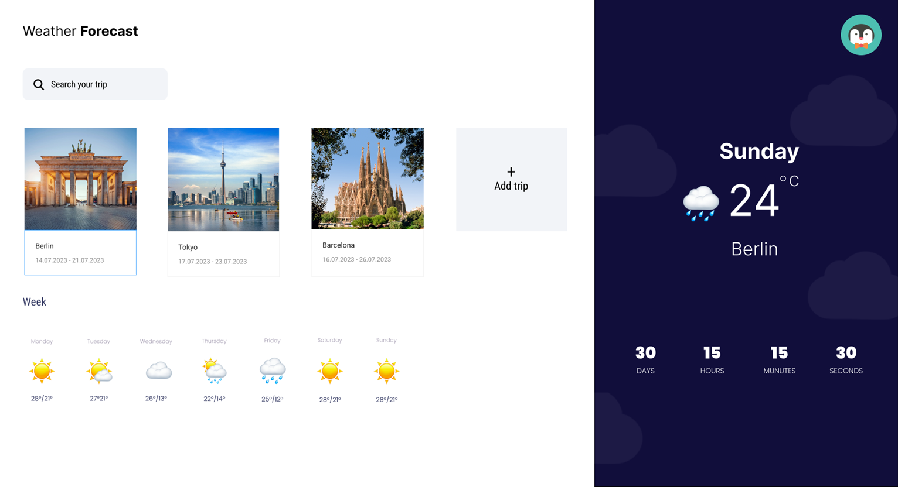
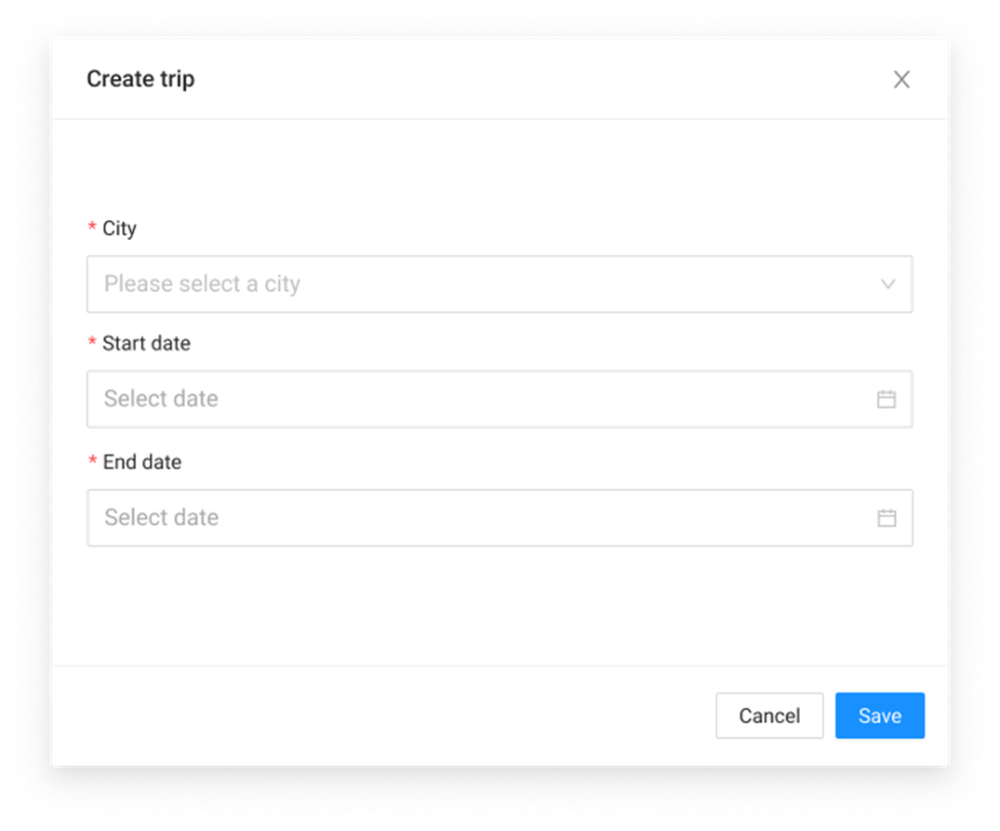

# Trip app with countdown timer and weather forecast

Using React.js (preferably, but you can use Angular or any other framework), implement a Trip app where users can see the weather forecast for their upcoming journeys, following these requirements:
1.	Visualization of the page: Main.png.
2.	Upon starting the application, user should already have a static list of trips (1 trip is enough). The list should be scrollable.
3.	When user selects a trip from the list, a forecast for each day of the trip should be displayed.
4.	On the top:

      -	There should be a possibility to search for a trip
5.	The app should include a button for adding a new trip. When the user clicks on "Add trip," a modal window should appear. Inside the modal, the user should have the ability to:

      -	Choose a city from a predefined list (you should have a mock list of cities that the API supports, with images).
      -	Enter the start date of the trip (the start date should be within the next 15 days).
      -	Enter the end date of the trip (the end date should be within the next 15 days).
      Upon clicking "Done," the trip should be added to the list.
      Modal visualization Modal.png
6.	On the right side of the page:

      -	When user selects a trip, today's weather forecast for that city should be displayed.
      -	There should be a countdown timer from the current date to the start date of the trip.

Additionally:
1.	Implement next and previous buttons for the list to handle scrolling better
2.	Sort trips by start trip date
3.	Implement login through third-party providers (Gmail, Facebook, etc.) - at least one of
4.	Implement store data (trips) after reloading page.

**Please, don’t use any UI components libraries, only HTML/CSS**

Free weather API: https://www.visualcrossing.com/resources/documentation/weather-api/timeline-weather-api/

Notes:
1. To get YOUR_API_KEY you need to register an account
2. Available 1000 recored/day for free

API for getting forecast from - to for the city
https://weather.visualcrossing.com/VisualCrossingWebServices/rest/services/timeline/[city]/[date1]/[date2]?unitGroup=metric&include=days&key=YOUR_API_KEY&contentType=json

API for getting today’s weather for the city
https://weather.visualcrossing.com/VisualCrossingWebServices/rest/services/timeline/[city]/today?unitGroup=metric&include=days&key=YOUR_API_KEY&contentType=json

**Main.png:**
**Modal.png:**
